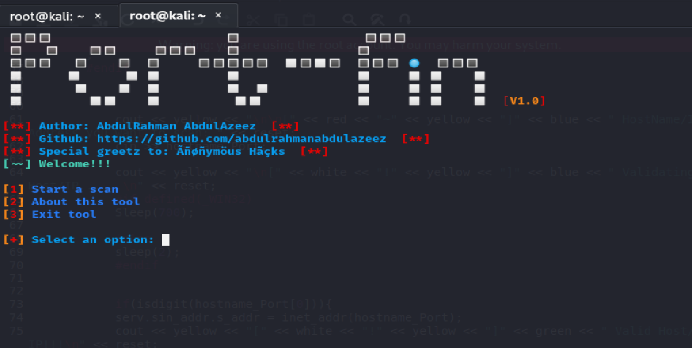
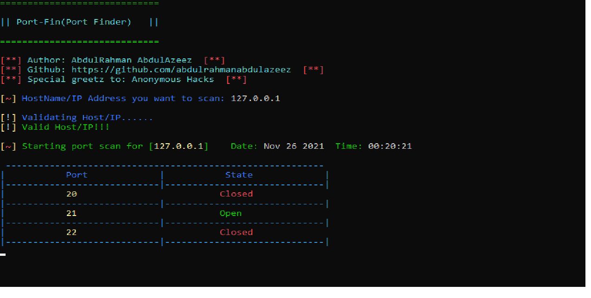

# PortFin
Port-Fin(port finder) is a tool which scans for open and closed port on a website/host. This tool scans the state of the well known/common ports.
```
Below are the ports scanned by this tool:
20,21,22,23,25,53,67,68,80,110,119,123,143,161,194,443

Note that the scanning of ports using this tool is not based on the user's 
specification. It will only be available in the next version of this tool.
```

# Platform(s)
* Windows  ✅
* Linux    ✅

# Requirement
* GCC Compiler

# Installation(Linux)
>https://github.com/abdulrahmanabdulazeez/PortFin.git

>cd PortFin

>g++ Pscan.cpp -o Pscan

>./Pscan

# Installation(Windows)
Clone to desktop;
>cd desktop

>https://github.com/abdulrahmanabdulazeez/PortFin.git

>cd PortFin

Link to lws2_32;

>g++ Pscan.cpp -lws2_32 -o Pscan

>./Pscan

# Screenshots





